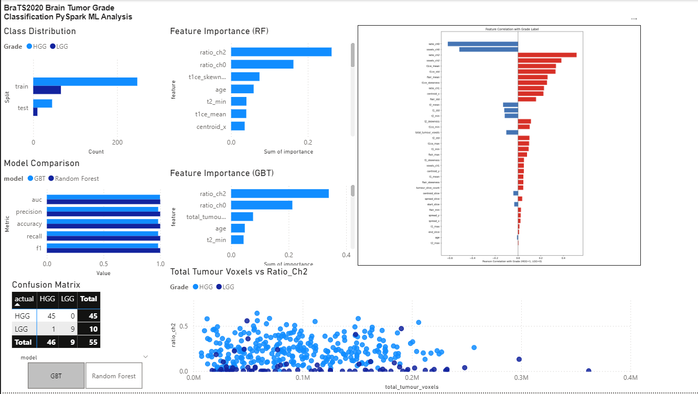
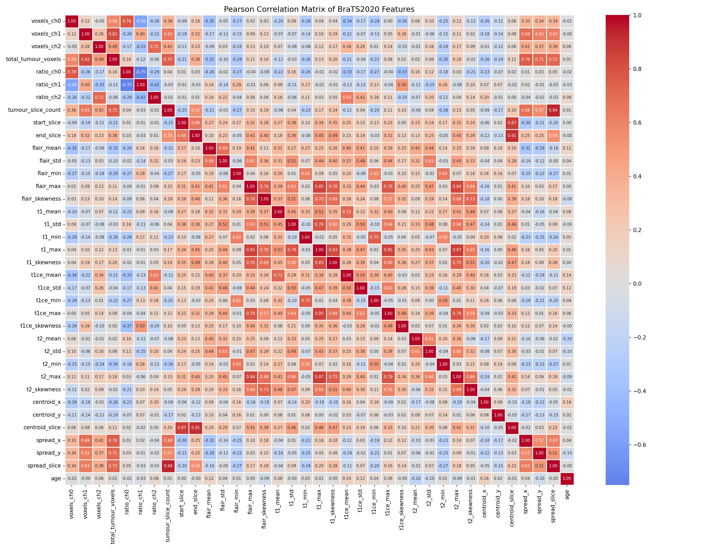
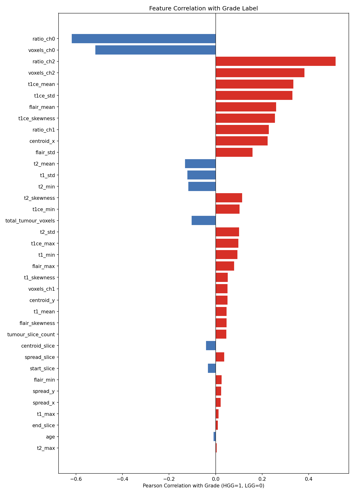

# BraTS2020 Tumour Grade Classification with PySpark

Classifies brain tumours as **High-Grade Glioma (HGG)** or **Low-Grade Glioma (LGG)** using radiomic features extracted from the BraTS2020 MRI dataset, processed and modelled entirely with Apache Spark.

---

## Dataset

**Brain Tumour Segmentation 2020 (BraTS2020)**

| Property | Detail |
|---|---|
| Volumes | 369 patients |
| Labels | HGG: 293 patients, LGG: 76 patients |
| Format | Per-slice HDF5 files (`volume_X_slice_Y.h5`) |

Each H5 file contains an `(H, W, 4)` image array and an `(H, W, 3)` binary mask array.

---

## Pipeline

```
BraTS20 Training Metadata.csv
        │
        ▼
1. Metadata Aggregation          (build_dataset.py -> no H5 reads)
   └─ voxel counts, sub-region ratios, tumour slice extent per volume
        │
        ▼
2. H5 Feature Extraction         (build_dataset.py -> feature_extraction.py)
   └─ per-modality intensity stats (mean, std, min, max, skewness)
   └─ 3-D tumour centroid and spatial spread
        │
        ▼
3. Label Merging
   └─ name_mapping.csv  → Grade (HGG / LGG)
   └─ survival_info.csv → Age   (median-imputed where missing)
        │
        ▼
   brats2020_features.csv  (369 rows × 41 columns)
        │
        ▼
4. Exploratory Data Analysis     (eda_spark.py -> PySpark)
   └─ grade distribution, summary stats, missing values
   └─ per-grade feature averages
   └─ Pearson correlation matrix (heatmap)
   └─ feature correlation with grade label (bar chart)
        │
        ▼
5. Feature Selection & Cleaning  (eda_spark.py)
   └─ dropped: voxels_ch0/1/2, t2_max, end_slice, t1_max,
               spread_x/y, t1_skewness, tumour_slice_count, start_slice
   └─ grade encoded: HGG=1, LGG=0
        │
        ▼
   brats2020_features_clean.csv
        │
        ▼
6. Model Training & Evaluation   (ml_spark.py -> PySpark ML)
   └─ Random Forest  — 5-fold CV
   └─ GBT Classifier — 5-fold CV
   └─ Hold-out test set (20%)
        │
        ▼
7. Export                        (ml_spark.py)
   └─ model_comparison.csv, rf/gbt_predictions.csv,
      rf/gbt_feature_importance.csv,
      class_distribution.csv, confusion_matrices.csv
```

---

## Key Findings

### Model Performance (5-Fold Cross-Validation)

| Model | CV AUC-ROC | Hold-out AUC-ROC |
|---|---|---|
| **Random Forest** | **0.9385** | **~0.9999** |
| GBT | 0.8877 | ~0.9978 |

Random Forest outperformed GBT on every metric under identical 5-fold CV conditions.
Note that the hold-out set was small (55 samples), so the near-perfect AUC-ROC may be optimistic, but the consistent CV superiority suggests RF is the stronger model for this dataset.

### Top Predictive Features (Random Forest)

`ratio_ch2` : the fraction of the whole tumour occupied by the **enhancing tumour** region is the single strongest predictor of grade. 

| Rank | Feature | Importance | Interpretation |
|---|---|---|---|
| 1 | `ratio_ch2` | 0.2619 | Enhancing tumour fraction, strongest HGG signal |
| 2 | `ratio_ch0` | 0.1625 | Necrotic core fraction |
| 3 | `t1ce_skewness` | 0.0740 | T1ce intensity distribution asymmetry |
| 4 | `age` | 0.0588 | Patient age, older patients skew HGG |
| 5 | `t2_min` | 0.0400 | T2 minimum intensity in tumour region |

### Class Distribution

The dataset is imbalanced (79.4% HGG / 20.6% LGG). The 5-fold CV strategy provides a more reliable performance estimate than a single split, reducing the risk of a lucky or unlucky hold-out draw.

---

## Dashboard

Power BI dashboard built from the exported CSVs — shows grade distribution, model comparison, feature importances, and confusion matrices.



### Correlation Visuals

| Pearson Correlation Matrix | Feature Correlation with Grade |
|---|---|
|  |  |

---

## Tech Stack

| Library | Version | Role |
|---|---|---|
| PySpark | 4.1.1 | Distributed data processing and ML |
| h5py | 3.16.0 | Reading per-slice MRI HDF5 files |
| NumPy | 2.4.4 | Numerical feature extraction |
| SciPy | 1.17.1 | Skewness calculation |
| pandas | 3.0.2 | Local aggregation and CSV export |
| Seaborn / Matplotlib | 0.13.2 / 3.10.8 | Correlation heatmaps |
| rich | — | Console output formatting |

---

## Project Structure

```
brats-spark/
├── feature_extraction.py      # H5 intensity + spatial extractors
├── build_dataset.py           # Full feature pipeline → brats2020_features.csv
├── read_metadata.py           # CSV inspection utility
├── eda_spark.py               # PySpark EDA + cleaned dataset export
├── ml_spark.py                # RF vs GBT with 5-fold CV + Power BI exports
├── requirements.txt
├── brats2020_features.csv         # Raw feature dataset (369 × 41)
├── brats2020_features_clean.csv   # Cleaned + encoded dataset
├── model_comparison.csv           # Metrics for both models
├── rf_predictions.csv             # RF test predictions
├── gbt_predictions.csv            # GBT test predictions
├── rf_feature_importance.csv
├── gbt_feature_importance.csv
├── class_distribution.csv
├── confusion_matrices.csv
└── visuals/
    ├── Pearson_Correlation_Matrix_BraTS2020_Features.png
    ├── Pearson_Correlation_with_Grade.png
    └── power_bi_screenshot.png
```

---

## Running the Pipeline

```bash
# 1. Install dependencies
pip install -r requirements.txt

# 2. Extract features from all 369 volumes (reads H5 files — takes ~10 min)
python build_dataset.py

# 3. EDA and clean dataset
python eda_spark.py

# 4. Train models and export results
python ml_spark.py
```
